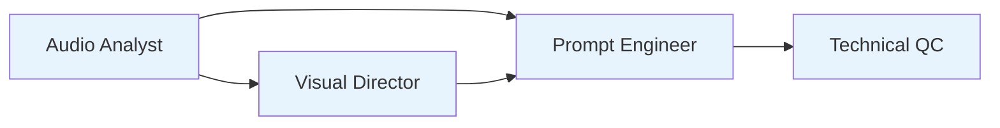
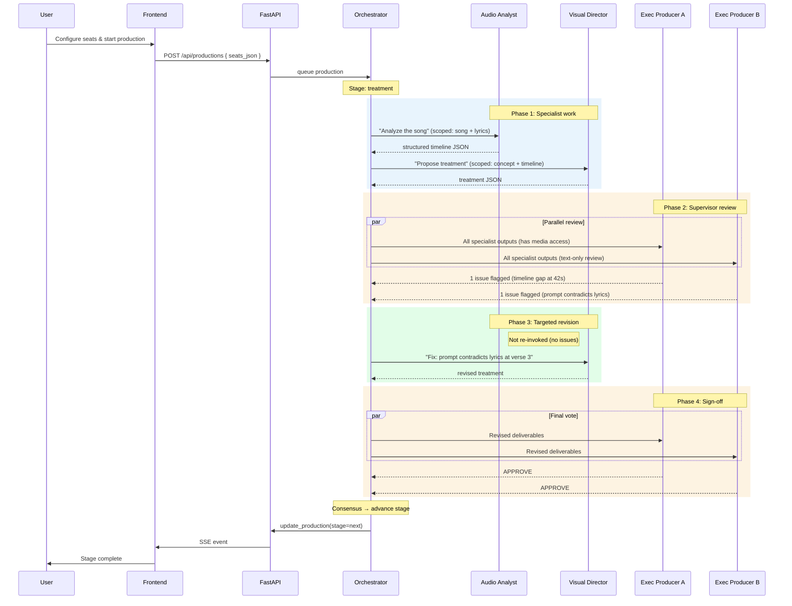

# Multi-Agent Production Council — Architecture & Design

> **Status**: POC proposal · Not yet implemented
> **Author**: Production engineering
> **Date**: 2025-08-23
> **Revised**: 2025-08-23 — Tiered agent model, role-scoped skills,
> multi-supervisor support

---

## 1. Vision

Replace the current hardcoded two-seat arrangement (Codex + AGY) with a
**tiered, dynamic N-agent production council**. Users configure 1–N
named agent seats across two tiers — **specialists** (focused, cheap,
narrow context) and **supervisors** (broad view, cross-domain
challenge). Each seat is backed by any installed CLI runtime and model,
declares its media capabilities, and receives only the context its role
requires.

### Design goals

| Goal | Constraint |
|---|---|
| **One agent works alone** | No debate round; solo agent drafts, self-reviews, and decides |
| **N agents debate** | Tiered propose → critique → challenge → vote protocol |
| **Mixed capabilities** | Each seat declares image / video / audio inspection ability |
| **Cost efficiency** | Role-scoped skills keep specialist context small and models cheap |
| **Cross-domain QC** | Supervisors catch conflicts that no single specialist can see |
| **Backward compatible** | Existing 2-seat productions keep running without migration |
| **No new external deps** | Uses the same CLI runtimes the bridge already manages |

---

## 2. Current state: what we are replacing

### Database (hardcoded columns on `productions`)

```
codex_runtime   TEXT    →  always 'codex' or 'agy'
codex_model     TEXT
codex_effort    TEXT
codex_session_id TEXT
agy_runtime     TEXT    →  always 'agy'
agy_model       TEXT
agy_effort      TEXT
agy_session_id  TEXT
```

### Backend orchestrator (`production.py`)

- `_codex()` and `_agy()` are separate methods with different
  invocation logic.
- `_media_agent()` picks whichever seat uses the AGY runtime because
  only AGY CLI can `view_file` on audio/video.
- `_other_agent()` picks whichever agent did **not** do the media pass.
- `_run_stage()` calls `_codex` and `_agy` by hardcoded name in a
  fixed order at every stage (propose → critique → revise → confirm).
- Both agents receive the **entire** production context (full lyrics,
  treatment, reference list, user history, skill context) regardless
  of whether the task requires it.

### Frontend (`production.tsx`)

- Two `<AgentSelect>` components, one labeled CODEX and one labeled AGY.
- `codex_runtime` is hardcoded to `'codex'` in the create form.
- The `Runtime` type is `'codex' | 'agy'`.

### Agent invocation (`agents.py`)

- `invoke_codex()` and `invoke_agy()` have different CLI argument
  shapes; `invoke()` dispatches on `runtime == "codex" | "agy"`.
- `model_catalog()` returns `{ codex: [...], agy: [...] }`.

### Cost problem with the current design

Both agents receive the same massive context and perform the same broad
analysis. Neither is scoped to a specific job. This means:
- Every agent invocation pays for the full production context in tokens.
- Both agents use expensive frontier models because neither task is
  narrow enough for a cheaper model.
- Redundant work: both agents independently evaluate areas where only
  one has real capability (e.g., both "review" audio but only AGY can
  actually decode it).

---

## 3. Tiered agent model

### 3.1 Two tiers

```
┌──────────────────────────────────────────────────────────┐
│                    SUPERVISOR TIER                        │
│                                                          │
│  Broad context · Frontier models · Invoked per stage     │
│  Reviews structured specialist outputs                   │
│  Catches cross-domain conflicts                          │
│  Challenges other supervisors                            │
│  Does NOT re-do specialist work                          │
│                                                          │
│  Examples: Executive Producer, Creative Director         │
├──────────────────────────────────────────────────────────┤
│                    SPECIALIST TIER                        │
│                                                          │
│  Narrow context · Cheap models · Focused skills          │
│  Receives only the slice of data its role needs          │
│  Produces structured deliverables                        │
│  Revises only when a supervisor flags its output         │
│                                                          │
│  Examples: Audio Analyst, Visual Director, Technical QC  │
└──────────────────────────────────────────────────────────┘
```

### 3.2 Why this is cost-efficient (not cost-multiplicative)

| Factor | Today (2 broad agents) | Tiered council (4+ agents) |
|---|---|---|
| **Context per agent** | Full production (~8k–15k tokens) | Role-scoped slice (~1k–4k tokens) |
| **Model tier** | Both frontier | Specialists use flash/cheap models |
| **Effort level** | Both high | Specialists use low/medium |
| **Redundant work** | Both analyze everything | Each does only its job |
| **Supervisor invocations** | N/A | 1–2 per stage (read structured summaries) |
| **Estimated total cost** | ~$X per stage | ~0.6–1.2× per stage |

The key insight: **4 focused cheap agents + 1 frontier supervisor ≈
the same cost as 2 unfocused frontier agents**, but with better quality
because each specialist actually does its job well and the supervisor
catches cross-domain issues neither broad agent would find.

### 3.3 Multiple supervisors

There is no singleton constraint on the supervisor tier. A production
can have 2+ supervisors backed by different runtimes and models:

| Seat | Tier | Runtime | Model | Why |
|---|---|---|---|---|
| Executive Producer A | supervisor | agy | gemini-3.1-pro | Has media access; can verify specialist claims against actual files |
| Executive Producer B | supervisor | codex | gpt-5.6-sol | Different reasoning model; challenges narrative coherence and prompt logic |

Supervisors without media capabilities are still highly valuable
because they review **structured deliverables** (JSON timelines, shot
plans, QC verdicts), not raw media. The specialists already translated
raw media into structured facts. A text-only supervisor catches:
- Narrative incoherence between treatment and shot prompts
- Lyric-to-timeline misalignment
- Prompt quality issues (vague directions, text-on-screen risk)
- Conflicting decisions between specialists
- Missing coverage (song sections with no planned shot)

When multiple supervisors disagree with each other, they debate using
the same consensus protocol (§5.4) before the final verdict.

---

## 4. Data model

### 4.1 Agent seat definition

A **seat** is a named participant slot in a production. It defines the
tier, runtime, model, effort level, declared media capabilities, and
the role skill that scopes its context.

```
┌───────────────────────────────────────────────────────┐
│                   AgentSeat                           │
├───────────────────────────────────────────────────────┤
│ id              TEXT  PRIMARY KEY (uuid)              │
│ production_id   TEXT  FK → productions                │
│ seat_index      INT   display & turn order (0-based)  │
│ label           TEXT  user-facing name ("Director")   │
│ tier            TEXT  'specialist' | 'supervisor'     │
│ runtime         TEXT  'codex' | 'agy'                 │
│ model           TEXT  e.g. 'gemini-3.1-pro-high'      │
│ effort          TEXT  e.g. 'high'                     │
│ can_image       BOOL  can inspect still images        │
│ can_video       BOOL  can inspect video files         │
│ can_audio       BOOL  can inspect audio files         │
│ session_id      TEXT  conversation continuity token    │
│ role_skill_id   TEXT  FK → role skill (scopes context) │
│ role_prompt     TEXT  additional role-level guidance   │
│ created_at      TEXT                                  │
│ updated_at      TEXT                                  │
└───────────────────────────────────────────────────────┘
```

### 4.2 Production table changes

Remove the six hardcoded agent columns. Add only:

```sql
ALTER TABLE productions ADD COLUMN seats_json TEXT
    NOT NULL DEFAULT '[]';
-- Populated by the create/config endpoints. The orchestrator reads
-- live seats from the new agent_seats table; seats_json is a
-- creation-time snapshot for the UI list view.
```

### 4.3 New `agent_seats` table

```sql
CREATE TABLE IF NOT EXISTS agent_seats (
    id              TEXT PRIMARY KEY,
    production_id   TEXT NOT NULL,
    seat_index      INTEGER NOT NULL,
    label           TEXT NOT NULL,
    tier            TEXT NOT NULL DEFAULT 'specialist',
    runtime         TEXT NOT NULL,
    model           TEXT NOT NULL,
    effort          TEXT NOT NULL,
    can_image       INTEGER NOT NULL DEFAULT 1,
    can_video       INTEGER NOT NULL DEFAULT 0,
    can_audio       INTEGER NOT NULL DEFAULT 0,
    session_id      TEXT,
    role_skill_id   TEXT,
    role_prompt     TEXT NOT NULL DEFAULT '',
    created_at      TEXT NOT NULL,
    updated_at      TEXT NOT NULL,
    UNIQUE(production_id, seat_index),
    FOREIGN KEY(production_id) REFERENCES productions(id) ON DELETE CASCADE
);
```

### 4.4 Shot attempt review columns

Replace `agy_review_json` / `codex_review_json` with a single
`reviews_json` column holding an array of `{ seat_id, review }` objects.

```sql
ALTER TABLE production_shot_attempts
    ADD COLUMN reviews_json TEXT NOT NULL DEFAULT '[]';
```

### 4.5 Global agent defaults

The existing `agent_settings` singleton table stores the user's default
seat template. Replace the fixed columns with `default_seats_json`:

```sql
ALTER TABLE agent_settings
    ADD COLUMN default_seats_json TEXT NOT NULL DEFAULT '[]';
```

The default value is seeded from the legacy columns on first migration
so existing installs do not lose their configured models.

---

## 5. Role skills and context scoping

### 5.1 What is a role skill?

A role skill is a focused instruction set that tells a seat:
1. **What it is responsible for** (its domain)
2. **What context it receives** (its data slice)
3. **What structured output it must produce** (its deliverable schema)
4. **What it should NOT do** (its boundaries)

Role skills are stored alongside production skills in the skill catalog
with `source = 'role'`. They are not user-editable in the POC — they
ship as built-in role templates.

### 5.2 Built-in role skills

#### Specialist roles

| Role skill | Domain | Context slice | Deliverable |
|---|---|---|---|
| `audio-analyst` | Song structure, timing, BPM, sections | Song file + lyrics only | Structured timeline JSON |
| `visual-director` | Treatment, visual language, composition | Concept + lyrics + references (images only) | Treatment + reference briefs |
| `prompt-engineer` | H3 prompt writing, camera, action | Treatment + timeline + references | Shot prompt array |
| `technical-qc` | Frame defect detection, anatomy, text bleed | Generated frames only | Pass/fail verdict per shot |
| `continuity-editor` | Cross-shot flow, identity, wardrobe | Shot frames + reference images | Continuity report |

#### Supervisor roles

| Role skill | Domain | Context slice | Deliverable |
|---|---|---|---|
| `executive-producer` | Cross-domain coherence, final authority | All specialist deliverables (structured JSON) | Approval, revision requests, escalation |
| `creative-director` | Narrative quality, emotional arc, brand | Treatment + prompts + timeline | Creative approval or challenge |

### 5.3 How context scoping works

The orchestrator builds context differently based on tier:

```python
def _build_seat_context(self, production, seat, specialist_outputs=None):
    if seat.tier == 'specialist':
        # Narrow context: only what this role needs
        skill = load_role_skill(seat.role_skill_id)
        context = skill.select_context(production)
        # e.g. audio-analyst gets: song_path, lyrics, duration
        # e.g. technical-qc gets: frame paths, acceptance criteria
        return skill.system_prompt + "\n\n" + context

    if seat.tier == 'supervisor':
        # Broad context: structured outputs from all specialists
        # but NOT raw media (unless the seat has that capability)
        context = self._base_context(production, seat.label)
        if specialist_outputs:
            context += "\n\nSPECIALIST DELIVERABLES:\n"
            for output in specialist_outputs:
                context += f"\n--- {output.seat_label} ---\n"
                context += json.dumps(output.content, indent=2)
        return context
```

### 5.4 Context size comparison

| Seat | Today's context | Scoped context | Reduction |
|---|---|---|---|
| Audio Analyst | ~12k tokens | ~2k tokens (song + lyrics) | **~85%** |
| Visual Director | ~12k tokens | ~4k tokens (concept + refs) | **~67%** |
| Technical QC | ~12k tokens | ~1k tokens (frames + criteria) | **~92%** |
| Executive Producer | ~12k tokens | ~6k tokens (summaries only) | **~50%** |

---

## 6. Orchestration protocol

### 6.1 One-agent flow (solo producer)

When exactly one seat is configured, the protocol is simple:

```
┌────────────┐
│  SOLO SEAT │
├────────────┤
│  Draft     │ → produce initial proposal
│  Self-QC   │ → review own output against criteria
│  Decide    │ → APPROVE or flag issues for user
└────────────┘
```

No debate rounds. The single agent does all tasks itself (treatment,
references, prompts, shot review). If the task requires a media
capability the seat does not have, the orchestrator raises an error
at project creation time.

### 6.2 Full tiered flow

```
┌─────────────────────────────────────────────────────────────┐
│  PHASE 1: Specialist work (parallel where independent)      │
│                                                             │
│  Audio Analyst ──→ structured timeline                      │
│  Visual Director ──→ treatment + reference briefs           │
│                     (may depend on timeline from audio)     │
│  Prompt Engineer ──→ shot prompt array                      │
│                     (depends on treatment + timeline)       │
│  Technical QC ──→ (idle until generation phase)             │
├─────────────────────────────────────────────────────────────┤
│  PHASE 2: Supervisor review                                 │
│                                                             │
│  All specialist deliverables are collected as structured     │
│  JSON and sent to every supervisor seat.                    │
│                                                             │
│  Supervisor A: reviews, flags 2 issues                      │
│  Supervisor B: reviews, flags 1 different issue             │
│                                                             │
│  If supervisors disagree on an issue:                       │
│    → debate round between supervisors only                  │
│    → consensus or escalate to user                          │
├─────────────────────────────────────────────────────────────┤
│  PHASE 3: Specialist revision (targeted)                    │
│                                                             │
│  Only the specialists whose deliverables were flagged       │
│  receive the supervisor's specific revision request.        │
│  Unflagged specialists are NOT re-invoked.                  │
├─────────────────────────────────────────────────────────────┤
│  PHASE 4: Supervisor sign-off                               │
│                                                             │
│  Supervisors receive the revised deliverables.              │
│  Vote: APPROVE or ESCALATE.                                 │
│  Consensus → advance stage.                                 │
│  No consensus after 2 rounds → escalate to user.            │
└─────────────────────────────────────────────────────────────┘
```

### 6.3 Specialist dependency graph

Not all specialists can run in parallel. The orchestrator respects
a dependency graph per pipeline stage:



- Audio Analyst runs first (others may need the timeline)
- Visual Director can start after audio analysis is complete
- Prompt Engineer needs both the timeline and the treatment
- Technical QC runs only during the generation/review phase

Seats without dependencies run in parallel via `asyncio.gather`.

### 6.4 Consensus rules

| Council composition | Consensus threshold | Tie-breaker |
|---|---|---|
| 1 seat total | N/A (solo) | N/A |
| 1 supervisor only | Supervisor decides | N/A |
| 2 supervisors | Both approve | User decides |
| 3+ supervisors | Strict majority (⌈N/2⌉ + 1) | User decides ties |

Within the specialist tier there is no voting — specialists produce
deliverables, they don't approve or reject the production.

Maximum debate rounds between supervisors: **2**.

Maximum total agent invocations per stage:
- Specialists: **1 initial + at most 1 revision = 2 per specialist**
- Supervisors: **1 review + 1 debate + 1 sign-off = 3 per supervisor**

### 6.5 Escalation to user

The orchestrator escalates to the user (sets status to
`awaiting_user`) when:
1. Supervisors cannot reach consensus after 2 debate rounds
2. A specialist fails and no fallback seat has the required capability
3. A supervisor explicitly sets `requires_user: true`

The escalation message includes every supervisor's position and
reasoning so the user can make an informed decision.

---

## 7. Capability model

Each seat declares three boolean capability flags:

| Flag | Meaning |
|---|---|
| `can_image` | The seat's CLI can open and inspect still images via its tools |
| `can_video` | The seat's CLI can decode and analyze video containers |
| `can_audio` | The seat's CLI can decode and analyze audio containers |

### Capability rules

1. **At least one seat must have `can_audio = true`** when the pipeline
   includes song analysis (all current pipelines do).
2. If no seat has `can_video`, the orchestrator skips frame-by-frame
   QC and relies on the approval gate for human review.
3. Capability flags are **user-declared**, not auto-detected. The
   orchestrator trusts them and routes media inspection tasks
   accordingly. If a user misconfigures, the agent will fail, and the
   failure is surfaced through normal error handling.
4. When a runtime is `agy`, the UI pre-checks `can_image`, `can_video`,
   and `can_audio` by default (AGY has `view_file`). When a runtime is
   `codex`, the UI pre-checks `can_image` only (Codex can receive
   `--image` attachments but cannot decode audio/video containers).

### How routing works

```
Media task arrives (e.g. "analyze the song")
  │
  ├─ Filter specialist seats where required capability is true
  │     e.g. can_audio=true for song analysis
  │
  ├─ 0 seats? → Error: "No agent with audio capability is configured"
  │
  ├─ 1 seat?  → That seat does it solo
  │
  └─ N seats? → Seat with lowest seat_index does the primary inspection;
                 others receive the structured output for their own use
```

---

## 8. Backend changes

### 8.1 `agents.py`

**No structural change to `invoke_codex` and `invoke_agy`.**

Add a new public method:

```python
async def invoke_seat(
    self,
    seat: AgentSeat,
    production_id: str,
    prompt: str,
    images: list[Path] | None = None,
    media_paths: list[Path] | None = None,
    on_output: AgentOutputCallback | None = None,
    on_heartbeat: AgentHeartbeatCallback | None = None,
    extra_dirs: list[Path] | None = None,
) -> AgentResult:
    """Route to the correct CLI based on seat.runtime."""
    return await self.invoke(
        seat.runtime, seat.label, production_id, prompt,
        seat.model, seat.effort, seat.session_id,
        images, on_output, on_heartbeat, extra_dirs,
    )
```

### 8.2 `production.py`

Replace `_codex()`, `_agy()`, `_media_agent()`, and `_other_agent()`
with a unified interface:

```python
async def _invoke_seat(
    self,
    production: dict,
    seat: AgentSeat,
    request: str,
    role_context: str | None = None,
    images: list[Path] | None = None,
    media_paths: list[Path] | None = None,
    fresh_session: bool = False,
) -> AgentResult:
    """Invoke any configured seat with role-scoped context."""
    context = role_context or self._build_seat_context(
        production, seat,
    )
    # ... existing retry/schema-echo logic applied per-seat
```

Add new orchestration helpers:

```python
def _specialists(self, production_id: str) -> list[AgentSeat]:
    """Return specialist seats ordered by seat_index."""

def _supervisors(self, production_id: str) -> list[AgentSeat]:
    """Return supervisor seats ordered by seat_index."""

def _seats_with_capability(
    self, production_id: str, capability: str,
) -> list[AgentSeat]:
    """Return seats with the requested capability, any tier."""

async def _specialist_phase(
    self,
    production: dict,
    stage_tasks: dict[str, StagTask],
) -> dict[str, AgentResult]:
    """Run specialists respecting the dependency graph."""

async def _supervisor_review(
    self,
    production: dict,
    specialist_outputs: dict[str, AgentResult],
) -> SupervisorVerdict:
    """Run supervisor review, debate, and consensus check."""

async def _council_round(
    self,
    production: dict,
    stage_tasks: dict[str, StageTask],
) -> CouncilResult:
    """Full tiered round: specialists → supervisors → revision."""
```

### 8.3 `_run_stage` refactoring

Each stage currently has inline `_codex(...)` / `_agy(...)` call
pairs. Replace with:

```python
# Before (hardcoded):
codex = await self._codex(production, "Propose treatment...")
agy   = await self._agy(production, f"Critique: {codex.content}")
final = await self._codex(production, f"Revise: {agy.content}")

# After (dynamic):
result = await self._council_round(
    production,
    stage_tasks={
        "audio-analyst": StageTask(
            prompt="Analyze the song structure...",
            required_capability="audio",
        ),
        "visual-director": StageTask(
            prompt="Propose the treatment...",
            depends_on=["audio-analyst"],
        ),
    },
)
```

The `_council_round` method internally handles solo, pair, and full
tiered flows using the protocol in §6.

---

## 9. Frontend changes

### 9.1 New `SeatConfigurator` component

Replaces the two fixed `<AgentSelect>` blocks. The user sees a
dynamic list of agent seats with add/remove controls.

```
┌─────────────────────────────────────────────────┐
│  Production council                   [+ Add]   │
│                                                 │
│  ┌─ Seat 1 ──────────────────────────────────┐  │
│  │ Label: [Audio Analyst       ]    [Remove] │  │
│  │ Tier:  [Specialist ▾]                     │  │
│  │ Runtime: [AGY CLI ▾]                      │  │
│  │ Model:   [Gemini Flash ▾]                 │  │
│  │ Effort:  [Low ▾]                          │  │
│  │ Capabilities:                             │  │
│  │   ☑ Images  ☐ Video  ☑ Audio              │  │
│  └───────────────────────────────────────────┘  │
│                                                 │
│  ┌─ Seat 2 ──────────────────────────────────┐  │
│  │ Label: [Executive Producer  ]    [Remove] │  │
│  │ Tier:  [Supervisor ▾]                     │  │
│  │ Runtime: [AGY CLI ▾]                      │  │
│  │ Model:   [Gemini 3.1 Pro ▾]               │  │
│  │ Effort:  [High ▾]                         │  │
│  │ Capabilities:                             │  │
│  │   ☑ Images  ☑ Video  ☑ Audio              │  │
│  └───────────────────────────────────────────┘  │
│                                                 │
│  ┌─ Seat 3 ──────────────────────────────────┐  │
│  │ Label: [Creative Director   ]    [Remove] │  │
│  │ Tier:  [Supervisor ▾]                     │  │
│  │ Runtime: [Codex CLI ▾]                    │  │
│  │ Model:   [GPT-5.6 Sol ▾]                 │  │
│  │ Effort:  [High ▾]                         │  │
│  │ Capabilities:                             │  │
│  │   ☑ Images  ☐ Video  ☐ Audio              │  │
│  └───────────────────────────────────────────┘  │
│                                                 │
│  ⓘ At least one agent with audio capability     │
│    is required for music video productions.     │
│                                                 │
│  Council: 1 specialist + 2 supervisors          │
│  Estimated cost: ~$0.08–0.15 per stage          │
└─────────────────────────────────────────────────┘
```

### 9.2 Validation

- Minimum 1 seat.
- Maximum 8 seats (cost/time guard).
- At least one seat must have `can_audio` checked.
- At least one supervisor seat is required when 2+ seats exist.
- Duplicate labels are rejected.

### 9.3 Preset configurations

Quick-start buttons for common setups:

| Preset | Seats |
|---|---|
| **Solo** | 1 supervisor (agy, full capabilities) |
| **Pair** | 1 specialist (agy, audio) + 1 supervisor (codex) |
| **Full council** | 3 specialists + 1 supervisor (agy) + 1 supervisor (codex) |

### 9.4 Message thread

The current `participant` field on messages already supports any
string value (`'codex' | 'agy' | 'user' | 'system'`). The seat label
becomes the participant name. The `ParticipantIcon` component maps the
runtime to the correct icon (Bot for codex, Sparkles for agy) and
shows a badge for the tier (★ for supervisor).

### 9.5 Activity indicators

The `AgentActivity` type already has `participant`, `runtime`, `model`,
and `effort` fields. No type change needed — just populate `participant`
from the seat label instead of the hardcoded `'codex'` / `'agy'`.

---

## 10. API changes

### 10.1 Production creation

```
POST /api/productions

- Remove: codex_runtime, codex_model, codex_effort,
          agy_runtime, agy_model, agy_effort
- Add:    seats_json  (JSON array of seat objects)
```

Each seat object:

```json
{
  "label": "Audio Analyst",
  "tier": "specialist",
  "runtime": "agy",
  "model": "gemini-2.5-flash",
  "effort": "low",
  "can_image": true,
  "can_video": false,
  "can_audio": true,
  "role_skill_id": "audio-analyst",
  "role_prompt": ""
}
```

### 10.2 Production configuration update

```
PATCH /api/productions/:id/config

- Remove: codex_model, codex_effort, agy_model, agy_effort
- Add:    seats_json
```

### 10.3 Agent settings defaults

```
GET  /api/settings/agents  → { default_seats: [...] }
PUT  /api/settings/agents  ← { default_seats: [...] }
```

### 10.4 Model catalog

No change to `GET /api/agents/models`. It already returns models
grouped by runtime. The seat configurator reads the correct list
based on each seat's selected runtime.

---

## 11. Migration strategy

### Phase 1: Database migration

1. Create the `agent_seats` table.
2. Add `seats_json` and `tier` columns.
3. For each existing production with `seats_json = '[]'`:
   - Insert two rows into `agent_seats` seeded from the legacy
     `codex_*` and `agy_*` columns (both as tier `supervisor`
     for backward-compatible behavior).
   - Write the corresponding JSON snapshot into `seats_json`.
4. The legacy columns remain readable but are no longer written.

### Phase 2: Backend dual-path

The orchestrator checks `agent_seats` for the production. If seats
exist, it uses the new `_council_round` path. If not (pre-migration
production), it falls back to the existing `_codex()` / `_agy()` path.
This lets running productions finish without interruption.

### Phase 3: Role skills

Ship built-in role skills as part of the skill catalog. Each maps to a
`role_skill_id` value. The orchestrator uses the skill to scope context
and structure the prompt.

### Phase 4: Frontend switchover

Ship the `SeatConfigurator` behind a feature flag. When enabled, it
replaces the two `<AgentSelect>` blocks. When disabled, the old UI
renders as today, reading from the legacy columns.

### Phase 5: Cleanup

Once all active productions have been migrated and the feature flag
is removed:

1. Drop the legacy agent columns from `productions`.
2. Drop the legacy columns from `agent_settings`.
3. Remove `_codex()`, `_agy()`, `_media_agent()`, `_other_agent()`
   methods.

---

## 12. Data flow diagram



---

## 13. Example configurations

### Minimum viable: solo producer

```json
[
  {
    "label": "Producer",
    "tier": "supervisor",
    "runtime": "agy",
    "model": "gemini-3.1-pro-high",
    "effort": "high",
    "can_image": true,
    "can_video": true,
    "can_audio": true
  }
]
```

One agent does everything. Cheapest and fastest. No debate.

### Budget pair: one specialist + one supervisor

```json
[
  {
    "label": "Audio Analyst",
    "tier": "specialist",
    "runtime": "agy",
    "model": "gemini-2.5-flash",
    "effort": "low",
    "can_image": false,
    "can_video": false,
    "can_audio": true,
    "role_skill_id": "audio-analyst"
  },
  {
    "label": "Executive Producer",
    "tier": "supervisor",
    "runtime": "agy",
    "model": "gemini-3.1-pro-high",
    "effort": "high",
    "can_image": true,
    "can_video": true,
    "can_audio": true
  }
]
```

### Full council: focused specialists + dual supervisors

```json
[
  {
    "label": "Audio Analyst",
    "tier": "specialist",
    "runtime": "agy",
    "model": "gemini-2.5-flash",
    "effort": "low",
    "can_audio": true,
    "role_skill_id": "audio-analyst"
  },
  {
    "label": "Visual Director",
    "tier": "specialist",
    "runtime": "codex",
    "model": "gpt-5.6-luna",
    "effort": "medium",
    "can_image": true,
    "role_skill_id": "visual-director"
  },
  {
    "label": "Technical QC",
    "tier": "specialist",
    "runtime": "agy",
    "model": "gemini-2.5-flash",
    "effort": "low",
    "can_image": true,
    "can_video": true,
    "role_skill_id": "technical-qc"
  },
  {
    "label": "Executive Producer",
    "tier": "supervisor",
    "runtime": "agy",
    "model": "gemini-3.1-pro-high",
    "effort": "high",
    "can_image": true,
    "can_video": true,
    "can_audio": true,
    "role_skill_id": "executive-producer"
  },
  {
    "label": "Creative Director",
    "tier": "supervisor",
    "runtime": "codex",
    "model": "gpt-5.6-sol",
    "effort": "high",
    "can_image": true,
    "role_skill_id": "creative-director"
  }
]
```

---

## 14. Risks and mitigations

| Risk | Impact | Mitigation |
|---|---|---|
| Specialist returns garbage | Supervisor wastes tokens reviewing junk | Structural validation on specialist output before supervisor handoff |
| Supervisors deadlock | Production stalls | Max 2 debate rounds, then escalate to user with all positions |
| Agent lacks declared capability | Media task fails at runtime | Validate capability at project creation; retry with a capable seat |
| Token context overflow | N critique payloads exceed supervisor context | Role skills cap specialist output size; supervisor receives summaries |
| Parallel specialists race on session | CLI sessions may conflict | Each seat has its own `session_id`; no shared state |
| Schema echo / placeholder responses | Already a problem with AGY today | Existing retry + fresh-session logic applies per seat |
| Legacy productions break | Running 2-seat productions crash | Dual-path fallback; legacy code untouched until Phase 5 |
| User picks all specialists, no supervisor | Nobody makes final decisions | UI enforces: ≥1 supervisor when ≥2 seats |

---

## 15. File inventory (estimated changes)

| File | Change type | Scope |
|---|---|---|
| `backend/production_db.py` | Schema + migration | New table, migration function |
| `backend/agents.py` | Add `invoke_seat` | Small addition |
| `backend/production.py` | Major refactor | Council protocol, context scoping |
| `backend/config.py` | Remove legacy defaults | Cleanup only (Phase 5) |
| `backend/main.py` | API changes | Seat CRUD endpoints |
| `src/production.tsx` | UI refactor | `SeatConfigurator`, presets, badges |
| `src/styles.css` | New component styles | Seat cards, tier badges |
| `tests/test_production_studio.py` | New test cases | Solo, pair, council flows |
| `config.example.json` | Update defaults | `default_seats` array |
| `.agents/skills/role-skills/` | New directory | Built-in role skill definitions |

---

## 16. Out of scope for this POC

- **Cross-runtime model sharing** (e.g., using a Codex model through
  the AGY CLI). Each runtime manages its own model catalog.
- **Agent-to-agent direct messaging** (agents read each other's
  output only through the orchestrator's structured handoff).
- **Weighted voting** (all supervisor seats have equal vote weight).
- **Runtime auto-discovery of capabilities** (capability flags are
  user-declared, not probed from the CLI).
- **User-editable role skills** (shipped as built-in templates; custom
  roles are a future extension).
- **Dynamic seat addition mid-production** (seats are locked at
  creation; configuration changes require a pause).
